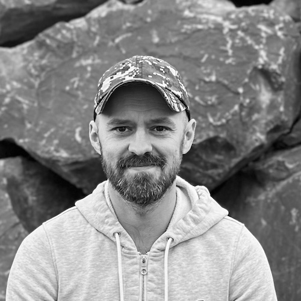
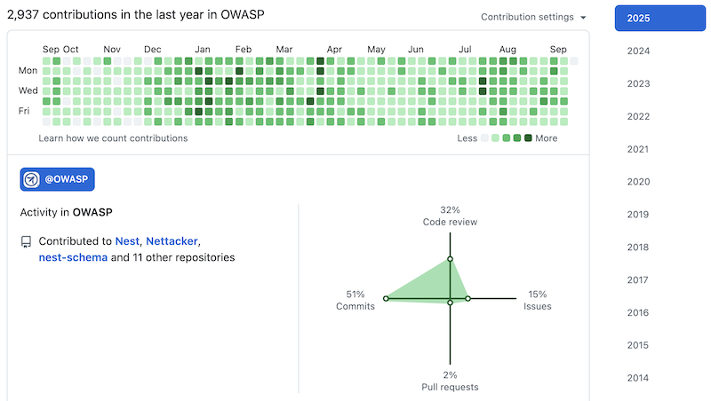
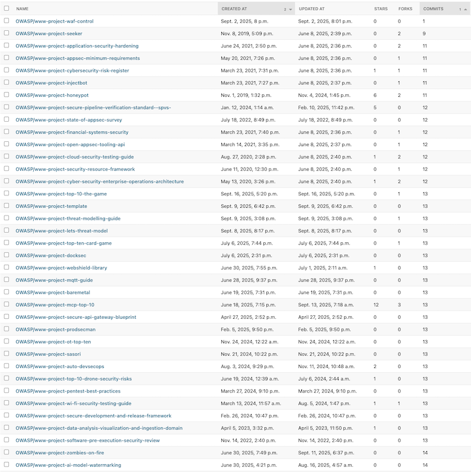
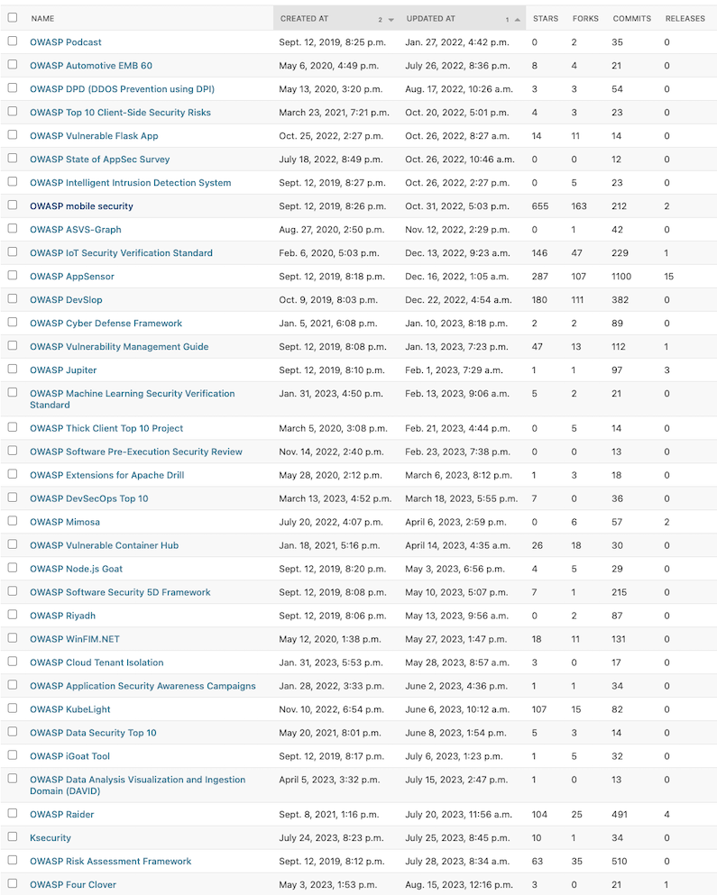
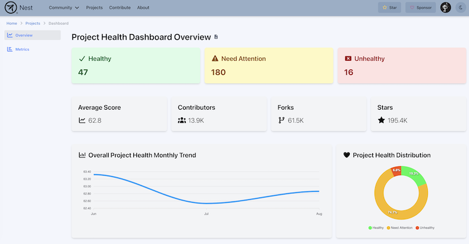
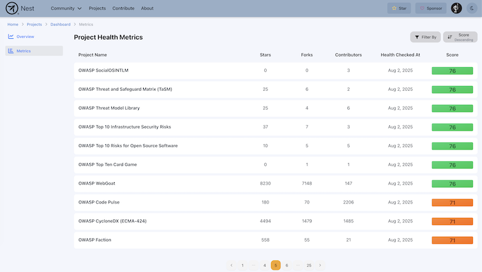

---

candidate: true
title: Arkadii Yakovets
layout: col-generic

---

#### About Me

Hi OWASP Community!

I'm Arkadii Yakovets (or just Ark), a cybersecurity leader and dedicated open-source contributor with over 20 years of experience in IT, specializing in application development and DevSecOps. Since joining OWASP in 2023, I've been actively volunteering to address community challenges and drive impactful initiatives. I'm also an OWASP Lifetime Member, committed to supporting the organization's long-term growth and success.

I've contributed to several OWASP projects, including ASVS and BLT, with my primary focus on project Nest, project Nettacker, and improving the overall health and well-being of the OWASP community.

As a mentor, I guide contributors across multiple coding events and projects, helping them develop their skills and deliver real-world results. Certified in ISC2 [CCSP](https://www.credly.com/badges/48541ff0-42fa-4344-a31d-5a5d4515591c) (Certified Cloud Security Professional), [CISSP](https://www.credly.com/badges/53907d05-1928-49cb-b974-24e2165cdacf) (Certified Information Systems Security Professional), and [CSSLP](https://www.credly.com/badges/c733a347-d1a6-4a9a-b9f0-9bda3c931aa7) (Certified Secure Software Lifecycle Professional), I am committed to strengthening OWASP's mission by promoting collaboration and increasing the community's overall impact.

Outside OWASP I lead Information Security (currently focusing on SOC 2 compliance) at a fast-growing company specializing in innovative open-source monitoring and observability solutions.

#### Link to My Video

[Arkadii Yakovets -- OWASP 2025 Global Board Elections](https://www.youtube.com/watch?v=OTNVu3sPrIc)

 
 

---

 
 

#### What open source contributions, research or visible leadership work have you done? If few, what 3 specific outcomes will you deliver in your first 90 days on the board in OWASP and how will members verify the progress?

I have actively contributed to the open source and OWASP community through a combination of leadership, mentorship, and project development:

- I started contributing to the Nettacker project in 2023 and, thanks to my high-impact work, was later invited to be a [co-leader](https://github.com/OWASP/Nettacker/blob/0fa6c156e3009c8e6f0eddbdffe8a415fd9e98ff/.github/CODEOWNERS#L6).
- I founded and launched the [OWASP Nest](https://nest.owasp.org/) (platform + community), growing it in about a year to [150+ GitHub stars, 200+ forks](https://github.com/owasp/nest), a [LinkedIn group](https://www.linkedin.com/groups/14656108/) with 200+ members, and a [Slack community](https://owasp.slack.com/archives/C07JLLG2GFQ) with 400+ members. OWASP Nest drives multiple objectives, such as enhancing [chapter](https://nest.owasp.org/chapters) and [project](https://nest.owasp.org/projects) discoverability, providing a [community members directory](https://nest.owasp.org/members), highlighting [contribution opportunities](https://nest.owasp.org/contribute), and sharing [monthly snapshots](https://nest.owasp.org/snapshots) of the OWASP community.
- I was nominated for the 2025 OWASP WASPY Project Person of the Year award for that.
- I presented at Global AppSec San Francisco 2024 and look forward to [presenting again](https://owaspglobalappsecusa2025.sched.com/event/29IlR/owasp-nettacker-project) at OWASP Global AppSec 2025 in Washington, DC.
- I've mentored 15+ GSoC and personally sponsored students contributing to various [OWASP](https://drive.google.com/file/d/1KSKisUj28bHKwvL0NoWhdIs4F9zUBwPM/preview) and [Python Software Foundation](https://drive.google.com/file/d/1Cwo6sMBa9wA4gXvck04ZrTOAlhsFeyWP/preview) projects, as well as supported around a hundred other contributors from around the world.
- I lead the Open World Holidays Framework, which currently serves over [17M monthly downloads](https://github.com/vacanza/holidays/?tab=readme-ov-file#holidays) and is just one step away from full [ISO 3166-1](https://www.iso.org/iso-3166-country-codes.html) compliance, already supporting 245 country codes.
- I'd volunteer for a local OWASP chapter too, but the closest one is about 150 miles (roughly 240 km) away.

My sustained contributions are reflected in my GitHub activity over the past years. The heatmap below shows the consistency and volume of my work, demonstrating not just bursts of activity but a long-term commitment to open-source and the OWASP community. You can easily verify this yourself by visiting [my GitHub page](https://github.com/arkid15r?org=OWASP).

 

 
 

Here are some of the **key ongoing tasks** I'm leading and actively working on to strengthen the OWASP community and its ecosystem:

- Finish [OWASP Nest API](https://www.linkedin.com/feed/update/urn:li:activity:7371629001359941632/) `v0` and release `v1` along with [Go](https://github.com/owasp/nest-sdk), [Python](https://github.com/owasp/nest-sdk-python), and [TypeScript](https://github.com/OWASP/nest-sdk-typescript) SDKs to make the OWASP ecosystem data more accessible (trackable via the [milestone URL](https://github.com/OWASP/Nest/milestone/9)).
- Populate all OWASP `www-` repositories (projects, chapters, committees) with [OWASP Schema](https://owasp-schema.readthedocs.io/en/latest/) compliant metadata for standardized, transparent entity information (trackable via the [milestone URL](https://github.com/OWASP/Nest/milestone/13)).
- Add OWASP Slack community [NestBot](https://owasp.slack.com/archives/D07MJFC2HM2) as an AI assistant to answer common questions and improve user experience (trackable via the [milestone URL](https://github.com/OWASP/Nest/milestone/8)).
- Launch OWASP Nest Mentorship Portal and scale the [OWASP Nest Sponsorship Program](https://owasp.slack.com/archives/C08EGFDD9L2) to attract more contributors, mentors, and strengthen community engagement (trackable via the [milestone URL](https://github.com/OWASP/Nest/milestone/12)).

In my first 90 days on the Board, I will focus on laying the foundation for solving OWASP's most pressing challenges (see the next question) by establishing clear structures for collaboration and accountability. My three specific outcomes will be:

1. **Launch targeted working groups**

   - Lead the creation of working groups focused on OWASP's top challenges, following the framework outlined in the [OWASP Working Groups Policy](https://policy.owasp.org/operational/working-groups).
   - Each group will have clearly defined objectives, responsibilities, and success criteria to ensure meaningful progress.

2. **Define and publish clear goals and milestones**

   - Collaborate actively as a member of the newly formed working groups to set measurable goals and short-term milestones.
   - Publish these plans openly so that every OWASP community member can track progress and hold the groups (particularly myself) accountable.

3. **Establish transparent progress reporting**

   - Introduce a simple reporting process where working groups share monthly updates in a public space.
   - This will allow community to verify progress and provide feedback, ensuring that outcomes are aligned with the community's needs.

These steps will ensure that from day one, there is visible movement toward addressing OWASP's internal challenges while fostering transparency and trust across the organization.

 
 

---

 
 

#### What do you see as the top three challenges for OWASP to increase impact and visibility worldwide? Please provide actionable plan which you can spearhead and lead if need be for the goals you plan to achieve

**1. Improving the OWASP Project Ecosystem and Internal Processes**

I don't micromanage (you can verify this by asking any of the mentees or mentors I've worked with) -- I've never believed that's the way to achieve a good balance between management and results. But I strongly believe that OWASP's global impact and visibility cannot be fully realized until we strengthen our own project ecosystem and streamline internal processes. Many projects are currently stalled, abandoned, or lack clear guidance for leaders and contributors, limiting OWASP's ability to consistently deliver value and gain recognition worldwide. We need a healthier and well-documented project ecosystem that enables OWASP projects to be more discoverable and have greater impact and visibility.

- Introduce the OWASP Project Ecosystem Improvement Plan, focusing on cleaning up abandoned or failed-to-launch projects while addressing the root causes rather than just the symptoms.
- Enhance project promotion, lifecycle management, and community engagement processes, ensuring leaders have the tools and guidance they need to succeed and contributors have clear paths to participate.
- Update the OWASP Project Handbook (last revised by Samantha Groves in January 2014) with clear, practical examples covering nowadays project development, promotion, funding, and other lifecycle scenarios, providing actionable guidance for project leaders.

**2. Expanding Contributor Engagement and Mentorship**

Attracting and retaining skilled contributors is essential for OWASP's growth and global visibility. However, the majority of open-source contributors are simply not aware of OWASP, our projects, or the opportunities to contribute, which limits our reach and impact.

- Implement the OWASP Mentorship Program, building on my experience, existing prototypes and PoCs, to attract more contributors and experienced mentors to the community.
- Leverage international coding events such as GSoC, WoC, GSSoC, SSoC, and Hacktoberfest to bring new contributors into OWASP projects and provide structured onboarding opportunities. I have participated in the vast majority of these events as a mentor, project admin, or both, and am familiar with their strengths and limitations. These events engage future developers, our key target audience, and help create a pipeline of skilled contributors. Some events attract more than [35,000 people](https://www.linkedin.com/posts/girlscriptsoc_girlscriptsummerofcode-girlscriptfoundation-activity-7373975750435205120-fLLj/).
- Organize a small, OWASP-branded security-focused (Hacktoberfest-style) event as a proof of concept, with clear KPIs to evaluate its impact and value before considering a larger scale rollout.

**3. Supporting High-Impact OWASP Board Initiatives**

A critical driver for OWASP's growth and impact is advancing the valuable initiatives already underway across the Board, making sure they receive the focus and resources needed to succeed. By closely following Board meetings, reviewing agendas and minutes, and watching past discussions, I have gained a solid understanding of current initiatives and how they contribute to OWASP's strategic priorities, including:

- OWASP revenue diversification and introduction of an annual impact report initiatives proposed by Steve Springett. I have been reviewing annual reports from [ISC2](https://edge.sitecorecloud.io/internationf173-xmc4e73-prodbc0f-9660/media/Project/ISC2/Main/Media/documents/annual-report/CORP-ISC2-Annual-Report-2024.pdf) and [CNCF](https://www.cncf.io/wp-content/uploads/2025/04/CNCF-Annual-Report-2024_v2.pdf) to gain insights and explore best practices. Why hasn't OWASP adopted a similar approach yet?
- OWASP Certification and Jobs Board ideas introduced by Sam Stepanyan. These initiatives align well with the previous revenue diversification effort and are brilliant ideas to implement, offering both increased OWASP impact and potential revenue growth.
- OWASP Board Director Qualification and Election Policy changes discussion led by Avi Douglen. It makes absolute sense to introduce minimum requirements for Board Directors to ensure the Board is governed by individuals who understand community needs, have made real contributions to OWASP's development, and have been actively involved well before the elections.

 
 

---

 
 

#### Several OWASP projects are stale and leads are unresponsive. If elected, what is your concrete, time bound plan to triage these projects, re-engage with inactive leads or relaunch based on clear criteria and timelines?

I'm in a unique position compared to other candidates because I've already been actively working on solving this issue [for quite some time](https://github.com/OWASP/Nest/issues/711). In fact, one of the main reasons I started OWASP Nest was the lack of a convenient, centralized way to navigate the OWASP project ecosystem, which led to the creation of OWASP Nest [project directory](https://nest.owasp.org/projects). While building this system and working on [OWASP Schema](https://github.com/OWASP/nest-schema/) I gained a complete view of the state of OWASP projects and identified two major problem areas:

**1. Failed-to-launch projects**
These are newly created projects that stalled at the initial repository setup stage without meaningful progress. Using OWASP Nest data, I found that if a `www-project-` repository has only the 13 initial commits required to populate it after a month, it's clear no real work has begun. Currently about 50 repositories fall into this category.

Click to view examples of failed-to-launch projects

 

 

**2. Abandoned projects**
These are projects that have remained inactive, with no updates or contributions for more than a year (a softer threshold may be used if needed). According to OWASP Nest data, over 75 projects haven't been updated in the past 12 months.

Click to view examples of potentially abandoned projects

 

 

My goal is **not just to solve this once, but to build a sustainable process** that keeps the OWASP project ecosystem healthy and transparent. This will be accomplished through the OWASP Nest Project Health Dashboard, which I designed and led the implementation of this summer. You can get a high-level understanding of the internals here: [project health metrics](https://github.com/OWASP/Nest/blob/49e3eb73cad9a3185fce276937b0128a7950dacf/backend/apps/owasp/models/project_health_metrics.py#L16), [project health requirements](https://github.com/OWASP/Nest/blob/49e3eb73cad9a3185fce276937b0128a7950dacf/backend/apps/owasp/models/project_health_requirements.py#L9). The project health data is going to be available for everyone as part of [OWASP Nest API](https://www.linkedin.com/feed/update/urn:li:activity:7371629001359941632/).

Here's how the plan would work:

1. Newly Created Projects
    - Establish a strict timeline for demonstrating progress after a project is approved, ensuring that new project leaders clearly understand expectations and the importance of showing progress.
    - If meaningful progress is not made within the agreed timeframe, the project will be flagged for review by the project committee and considered for archiving.
    - This helps prevent the accumulation of inactive "ghost projects" and ensures OWASP maintains a list of active, valuable initiatives.

2. Existing Stale Projects
    - Implement a grace period process to give current leaders a fair chance to revive their projects.
    - Leaders will be contacted multiple times through various channels, including their `@owasp.org` emails, which they are expected to check regularly.
    - If there's no response or interest, the project will be flagged for review by the project committee.
    - If the project has community value, we'll seek new leaders.
    - If not, the project will be flagged for retirement by the project committee.
    - All steps will be carried out in close communication with current leaders to prevent any misunderstandings or confusion.

3. Existing Projects Needing Attention
    - Identify active projects that are not stale but would benefit from additional focus and guidance from their maintainers.
    - Send automated notifications regarding changes in the project's health score based on current metrics.
    - If the project eventually becomes inactive or abandoned, escalate it to the Existing Stale Projects plan of action for review and potential archiving or leadership change.

The Project Health Dashboard will automate (it actually already does daily metric collection) much of this work by:

- Tracking metrics like update frequency, forks, stars, issue/PR resolution time, etc.
- Sending automated alerts to project leaders about issues like inactivity or missing compliance points (e.g., `funding.yaml`).
- Providing clear visibility to the community and OWASP leadership.

Some additional problems I plan to address include:

- Projects still hosted in personal GitHub repositories instead of OWASP's organization.
- Enforcing best practices outlined in [OWASP's project guidelines](https://owasp.org/www-committee-project/#div-practice) and [Project Policy](https://policy.owasp.org/operational/projects).

##### Time bound plan (~6 months)

- 1 month to gather community feedback on metrics and their relative weights. Based on my experience, this process is more challenging than it may appear.
- 3 months to build, test, and integrate an automated monitoring/alerting system on top of the existing Project Health Dashboard (extend the dashboard with the new features).
- 1 month for leaders to provide additional feedback based on their experience.
- 1 month included as an extra, rough estimate in line with best practices.

##### Why This Matters

This is more than a cleanup effort -- it's about **respecting the value of OWASP projects and leadership**. Being an OWASP project leader should be an honor, representing a real commitment to the community.

The dashboard will ensure transparency, fairness, and accountability while keeping the OWASP ecosystem valuable. To kickstart this effort, I personally sponsored the development of the dashboard through the [OWASP Nest Sponsorship Program](https://owasp.slack.com/archives/C08EGFDD9L2) after it was not accepted as a GSoC 2025 project. **It is now fully ready to be expanded and built upon**.

 
 

 
 

---

 
 

#### What kind of support will you provide for Arab countries in regard to trending legislation in security, privacy and data protection, for software, OT, and cloud? Will you plan for specific events to cover the growth of talents and skills in secure coding in this particular region?

To empower Arab countries in navigating evolving security, privacy, and data protection landscapes, and to nurture the next generation of secure coding talent, I plan to:

- Collaborate with local chapter leaders to support the growing needs around these topics and understand regional challenges.
- Encourage mentorship programs where experienced OWASP project leaders help onboard and guide new contributors from the region to enable practical skill development.
- Advocate for Arabic language resources not only for flagship projects like OWASP Top 10 and ASVS but also for documentation, webinars, and training content, as this is likely one of the easiest ways to engage new contributors and get them involved in OWASP projects.

Additionally, I want to highlight what’s already being done. As part of OWASP Nest development, I have been directly supporting a contributor from Egypt through the [OWASP Nest Sponsorship Program](https://owasp.slack.com/archives/C08EGFDD9L2/p1748630622031629), which I fund personally. While this contributor happens to be from an Arab country, the selection was based solely on merit -- the candidate was the most capable, demonstrating exceptional dedication and delivering solutions that address real-world problems. I'm personally very pleased with this sponsorship-based collaboration. This experience also highlights the value of systems like GitHub Sponsors, which allow supporting talented open source contributors from anywhere in the world.

 
 

---

 
 

#### Your Vote Matters

I need your vote to build further on the work I've been doing -- strengthening the OWASP community from within and removing the obstacles that slow us down. Going forward, I'm committed to tackling challenges not only from the bottom up but also from the top down, ensuring that every level of the organization is empowered to succeed.

If you decide not to vote for me, please consider supporting someone who shares my vision for addressing community internal issues and **make sure to do your part** by reading all the candidates' programs first.

Thank you for helping strengthen the OWASP community!

#### Disclaimer

Some parts of this page were refined with the help of a GPT-based tool to improve clarity and readability. I used this tool to smooth out rough edges in the text while ensuring that **all plans and positions presented here are my own**.

 
 

--
Arkadii Yakovets  
OWASP Nest, OWASP Nettacker  
CCSP, CISSP, CSSLP  
[https://github.com/arkid15r](https://github.com/arkid15r/)
