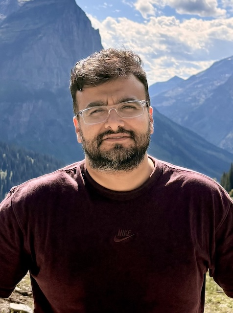

---

candidate: true
title: Arvind Janardhanan
layout: col-generic

---

#### About Me

Hi there, I’m Arvind Janardhanan—a seasoned cybersecurity leader with over 15 years of experience in enterprise security, specializing in secure software development, DevSecOps, and enterprise security architecture. Throughout my career, I’ve had the privilege of architecting security solutions at scale—solutions built with a security-first mindset that empower development teams to innovate confidently and securely.

While I haven’t directly contributed to OWASP or open source projects, I’ve been a long-time and ardent consumer of OWASP’s resources. From threat modeling to the OWASP Top 10 to secure coding practices, OWASP has been foundational in shaping the security posture of the organizations I’ve served. I see this candidacy as an opportunity to give back—by bringing the voice of OWASP’s largest consumers, enterprise security teams, closer to the community that builds the tools and standards we rely on every day.
My work has focused on designing and delivering scalable application security programs and integrating comprehensive security toolchains across SAST, SCA, MAST, IaC, DAST, secrets detection, API, and cloud security. I’ve led and continue to lead initiatives in vulnerability management, posture management, and secure-by-default capability delivery—always with an eye toward enterprise adoption and real-world constraints.

What drives me is the opportunity to bridge the gap between cutting-edge security research and practical, actionable guidance. I believe security standards must be both aspirational and achievable—empowering teams of all sizes, not just the well-resourced, to build secure software. That’s where I believe OWASP can lead, and where I hope to contribute.

My leadership philosophy is rooted in empowerment, mentorship, and inclusive collaboration. I’ve built and led diverse, global teams of engineers, architects, and consultants, and I’ve seen firsthand how the best security solutions emerge when different perspectives and experiences come together. I want to bring that same spirit to OWASP.

I understand the challenges of implementing security frameworks in complex environments—where legacy systems, tight deadlines, and competing priorities are the norm. I bring to OWASP a pragmatic, enterprise-tested perspective on what it takes to make security guidance not just technically sound, but truly adoptable at scale.

I envision OWASP as a catalyst for transformation—an organization whose collective wisdom, tools, and frameworks not only define best practices, but also empower organizations to implement them effectively. I see my board service as a way to help extend OWASP’s impact beyond enterprise boundaries and into the broader open source community, contributing to its continued evolution to meet tomorrow’s security challenges.

If elected, I will bring a collaborative leadership style focused on building bridges—between innovation and implementation, between enterprise lessons and community needs, and between where we are today and where application security must go next.
 

#### Link to My Video
[Candidate Name](#)
 
 

#### What open source contributions, research or visible leadership work have you done? If few, what 3 specific outcomes will you deliver in your first 90 days on the board in OWASP and how will members verify the progress?
 
 
While my contributions have primarily been in enterprise environments rather than open source, I bring a perspective OWASP critically needs: scaling security practices across large, complex organizations under real-world constraints. Throughout my career, I’ve applied OWASP principles to drive measurable impact—embedding application security into workflows, toolchains, and culture.

**Enterprise-Driven Contributions**
- Architected security toolchains across SAST, SCA, MAST, IaC, DAST, secrets detection, and API security—using OWASP resources as foundational guidance.
- Built platforms that embed OWASP recommendations into developer workflows, creating real-world implementation patterns and validation data.
- Applied Research at Scale: 15+ years of testing OWASP methodologies under enterprise constraints—tight timelines, legacy systems, and budget limitations.
- Developed models to measure AppSec program effectiveness and maturity.
- Solutioned integration patterns that demonstrate successful OWASP framework adoption in CI/CD pipelines through proven DevSecOps patterns.
- Scaled and implemented OWASP Top 10, SAMM, and ASVS across multiple organizations, adapting them for enterprise-wide adoption.

This is how I’ve come to understand visible leadership — through secure-by-default systems, scalable programs, and empowered teams that have grown from applying OWASP guidance in real-world enterprise environments. My eagerness to serve on the OWASP board represents an opportunity to give back to the community that has shaped my AppSec career. Instead of open source code contributions, I offer battle-tested insights into what works, what needs refinement, and how to make OWASP frameworks more adoptable across diverse environments within enterprise settings.

 
If elected, I will focus on transparency, engagement, and innovation. Here’s what I will plan to deliver in the First 90 Days,

##### Outcome 1: Complete Project Portfolio Health Assessment & OWASP Project Health Dashboard
**Deliverable:** Launch a comprehensive public dashboard assessing all 398 OWASP projects across 16 domains [Additional details outlined in Question no 3].
**Specific Actions:**
- Deploy metrics tracking based on GitHub activity, issue response times, maintainer engagement, and technical debt indicators
- Categorize all projects using BCG matrix analysis (Stars, Cash Cows, Question Marks, Dogs) within domain-specific contexts
- Create public dashboard at `health.owasp.org` showing real-time project health scores and maintenance status
**Verification Method:**  GitHub-integrated dashboard, downloadable reports, and a transparent methodology. All the criteria will be published on GitHub with community feedback integration.

##### Outcome 2: Direct Leadership Engagement & Succession Planning
**Deliverable:** Connect with 150+ project leaders and document leadership gaps.
**Specific Actions:**
- Outreach via via email, Slack, LinkedIn, and community.
- Standardized health assessment questionnaire (14-day response window)
- Implement escalation protocol
- Document leadership gaps and create succession planning framework for unresponsive projects
**Verification Method:** Monthly public reports, anonymized logs, and leadership directories. 

##### Outcome 3: Strategic Domain Focus Groups & Launch Innovation Pipeline
**Deliverable:** Establish active focus groups for all 16 security domains with identified community leaders and launch innovation charter for emerging security needs.
**Specific Actions:**
- Recruit domain champions across 16 domains (and emerging skews)
- Monthly community calls for each domain with published agendas and meeting notes
- Create innovation pipeline framework for emerging needs: Quantum Security, Web3, Zero-Trust Architecture projects
- Launch voting platform for innovation project prioritization
**Verification Method:** Public calendars, meeting minutes, and success metrics. Domain leaders will be publicly listed along with targeted success metrics.

##### Measurement & Accountability
**Progress Tracking:**
- **Weekly Updates:** Published every Friday on OWASP blog
- **Community Verification:** All data sources, methodologies, and progress reports available on GitHub
- **Success Metrics:** 
  - Project health dashboard operational with 100% project coverage
  - Transparency on % leadership response rate across all domains
  - 16 active domain focus groups with confirmed community leaders

 
 

#### What do you see as the top three challenges for OWASP to increase impact and visibility worldwide? Please provide actionable plan which you can spearhead and lead if need be for the goals you plan to achieve
 
 

**Challenge 1**: Developer Engagement & Resource Constraints

Developers adoption of OWASP resources due to poor integration with existing workflows (lack of treating security as a core skill/requirement), along with OWASP's ~$3.2M annual budget severely limits program expansion and project support capabilities.

Action Plan: Launch the "DevSec Integration Initiative" to embed OWASP guidance directly into popular computer science, devEx and AI sepcific university and in-platfrom trainings . This provides contextual security fitment seamlessly within existing developer workflows. Simultaneously, establish "Corporate Security Partnerships" featuring premium sponsorship levels ($50K-$250K) that offer corporate commitment to OWASP project contributions and research partnership, specifically targeting Fortune 500 companies with dedicated security teams and OSPOs.

**Challenge 2**: AI-Generated Code Security Crisis

Despite 97% developer adoption of generative AI, a large % of AI-generated code contains OWASP Top 10 vulnerabilities. This represents a paradigm shift from traditional "code-to-cloud" security to "prompt-to-cloud" security, requiring fundamentally different approaches to application security throughout the development lifecycle.
Action Plan: Establish/Evangelize/Prioritize the "OWASP AI SecureCode Initiative" to create real-time security validation plugins and custom instructions for major platforms including GitHub Copilot, Cursor, Claude Code, and VSCode. These tools will provide vulnerability reduction and potential improve detection with OWASP-compliant remediation suggestions during AI-assisted code generation, addressing security at the point of creation.

**Challenge 3**: Quantum Transition & Next-Generation Security Education
With RSA-2048 cryptography vulnerable by 2029, organizations lack comprehensive post-quantum migration guidance. Additionally, traditional security training frameworks are inadequate for AI-augmented development and future quantum-aware application architectures.
Action Plan: Deploy the "OWASP Quantum-Safe Transition Program" featuring comprehensive PQC migration playbooks, automated cryptographic inventory tools, and quantum-safe coding standards developed in partnership with NIST. Complement this with the "OWASP Next-Gen Security Certification" - a hybrid online and hands-on program covering AI prompt security, quantum-safe architecture design, and automated security validation methodologies, targeting 10,000 developers annually through strategic corporate partnerships.

Leadership Commitment, I will help collaboratively lead transformative initiatives, leveraging my enterprise security architecture expertise, with support of active OWASP community engagement, and industry network to deliver measurable impact, trageting the positioning of OWASP as the authority for application security in the AI-quantum era.

 
 

#### Several OWASP projects are stale and leads are unresponsive. If elected, what is your concrete, time bound plan to triage these projects, re-engage with inactive leads or relaunch based on clear criteria and timelines?
 
 
If elected, I will lead OWASP’s transformation with the same rigor I’ve applied to enterprise execution, program delivery, and inclusive governance. My approach centers on strategic realism and board alignment, grounded in data-driven assessment. With nearly 200 OWASP projects showing signs of staleness—due to low maintenance, outdated relevance, or leadership gaps—this transformation demands executive-level intervention guided by community-driven solutions. I propose a three-phase, 12-month plan to build a healthier, more focused global project portfolio. While some of this is aspirational, I believe these are the right steps to move OWASP in the direction it needs to go.

I’ve classified OWASP’s ~400 projects into 16 security domains that span the full security landscape. These domains are grouped by strategic priority:

**Foundation Domains:**
- **Web Application Security** - Foundation domain with Top Ten, ASVS, Cheat Sheets
- **AI/ML & GenAI Security** - Fastest growing with GenAI Security, LLM Top 10
- **Supply Chain & Dependency Security** - Highest ROI with CycloneDX, Dependency-Check
  
**Growth Domains:**
- **Cloud-Native & Container Security** - Kubernetes, Docker, Serverless security
- **DevSecOps & CI/CD Security** - SAMM, pipeline security frameworks
- **Mobile Security** - Mobile Application Security, Mobile Top 10
- **API Security** - Growing domain with API Security Project
  
**Essential Operations:**
- **Vulnerability Management & Testing** - DefectDojo, OWTF, testing tools
- **Security Training & Education** - Juice Shop, WebGoat, training platforms
- **Threat Modeling & Risk Assessment** - Threat Dragon, risk frameworks
  
**Specialized Domains:**
- **Network Security & Intelligence** - Amass, reconnaissance tools
- **Code Security & Static Analysis** - ESAPI, code review guidance
- **IoT & Emerging Technologies** - Internet of Things, Low-Code security
- **Privacy & Compliance** - Privacy risks, compliance frameworks
- **Application Firewall & Defense** - CRS, Coraza WAF
- **Integration & Standards** - Cross-cutting integration approaches

Strategic Plan: Three Phases Over 12 Months,

##### Phase 1: Immediate Triage & Accountability **Timeline: First 3 months**
###### Automated Health Assessment
- Deploy enterprise-grade metrics across all 398 projects: GitHub activity, issue responsiveness, technical debt indicators
- Domain-specific evaluation using our 16-category framework to assess strategic value vs. maintenance burden
- Public transparency dashboard showing real-time project health across all domains—complete accountability, no hiding
###### Direct Leadership Engagement
- Personal outreach to 150+ project leaders across all 16 domains with clear response requirements (14-day deadline)
- Escalation protocol: Email → Slack → LinkedIn → Community nomination for replacement
- Document everything: Response rates, engagement quality, succession planning needs by domain
###### Strategic Value Classification
- Apply BCG matrix analysis to categorize projects within each domain: Stars (high value, active), Cash Cows (stable value), Question Marks (potential), Dogs (retirement candidates)
- Domain expert panel input from recognized leaders in each of the 16 security areas
- Transparent criteria publication for all triage decisions with domain-specific considerations

##### Phase 2: Domain-Focused Transformation **Timeline: Months 4-6**
###### Priority Domain Investment Strategy
**Tier 1 Critical Domains (Immediate Focus):**
- **Supply Chain & Dependency Security:** Emergency health investment for CycloneDX ecosystem (something everyone uses and needs attention)
- **Web Application Security:** Aggressive consolidation while protecting Top Ten, ASVS legacy
- **AI/ML & GenAI Security:** Innovation acceleration as fastest-growing security domain
  
**Tier 2 High-Impact Domains (Secondary Focus):**
- **DevSecOps & CI/CD Security:** Enterprise pipeline integration focus
- **Vulnerability Management & Testing:** Tool consolidation opportunity
- **Security Training & Education:** Community education mission preservation
  
**Tier 3 Specialized Domains (Targeted Intervention):**
- **Cloud-Native, Mobile, API Security:** Modernization for current tech stacks
- **IoT, Privacy, Network Security:** Emerging threat response and compliance alignment

###### Systematic Project Actions Across All Domains
**Immediate Retirement (target: 20% projects across domains):**
- **Integration & Standards:** Legacy integration approaches
- **Code Security & Static Analysis:** Outdated security libraries
- **Network Security & Intelligence:** Projects superseded by commercial tools (may require more focus to have value in OSS)
- **IoT & Emerging Technologies:** Early experimental work projects
- **Clear exit criteria:** Zero activity >18 months + technical obsolescence + no strategic value
  
**Strategic Consolidation:**
- **Web Application Security:** Consolidate stale projects into maintained packages
- **Vulnerability Management:** Merge stale projects into unified testing tools
- **Security Training:** Modernize stale projects into contemporary learning platforms
- Community-driven migration support ensuring user continuity across all domains
  
**Innovation Pipeline Launch:**
- New project charter framework for emerging needs: Quantum Security, Web3, Zero-Trust Architecture
- Domain-specific innovation tracks aligned with technology evolution in each area
- Community voting platform for prioritizing investments across all 16 domains
- Partner with GenAI code generation solutions like Cursor, Claude, GitHub Copilot to build custom instruction projects and OWASP policy guardrails

##### Phase 3: Sustainable Governance & Community Ownership **Timeline: Months 6-12 **
#### Domain-Centric Leadership Model
- Establish 16 Domain Focus Groups with recognized community experts leading each security area
- Monthly domain community calls with cross-domain coordination for overlapping projects
- Annual OWASP Strategy Summit for portfolio planning across all security domains
#### Continuous Health Monitoring
- Quarterly automated assessments with domain-specific health metrics and early warning systems
- Public accountability reports showing progress against stale project reduction targets by domain
- Cross-domain innovation opportunities identifying synergies between security areas
#### Innovation & Modernization Framework
- Technology trend monitoring for emerging threats across all 16 domains
- Academic partnerships for research-driven development in each security area
- Enterprise advisory boards ensuring commercial relevance across the complete security landscape
- Key focus on building strategic partnerships with OSPOs of top enterprises

##### Success Metrics & Community Accountability
Each phase will be measured against **OKR/SMART style goals:**
###### With set Targets like:
- **Stale project rate:** 49.5% → 25% through strategic retirement and health investment across domains
- **Domain leadership:** 100% of 16 domains have active focus groups and identified community leaders
- **Leadership responsiveness:** 90% response rate to community communications across all project areas
- **Portfolio optimization:** 398 → 250 strategically-focused projects across refined 16-domain structure
- **Domain excellence:** Each of 16 domains has clear value proposition and active community
- **Innovation pipeline:** 12+ new project charters developed through community prioritization across emerging security areas
- **Enterprise adoption and participation:** 50% increase in Fortune 500 usage across core domains, including documented partnerships with enterprise OSPOs

While OWASP is open source and should always remain so, my leadership philosophy will drive **Community-Driven Excellence Across All Security Domains**. This challenge demands senior executive-style enterprise thinking applied to open-source governance:
- **Data-driven decisions** with transparent criteria applied consistently across all 16 domains
- **Direct accountability** through personal engagement and public reporting on domain health
- **Strategic focus** on domains that create maximum value while preserving OWASP's comprehensive coverage
- **Inclusive innovation** where the best ideas win through democratic processes in each security area

##### My Vision 
**Transform OWASP from 398 fragmented projects into 16 world-class security domains that define standards, drive innovation, and serve millions globally.** 

 
 

#### What kind of support will you provide for Arab countries in regard to trending legislation in security, privacy and data protection, for software, OT, and cloud? Will you plan for specific events to cover the growth of talents and skills in secure coding in this particular region?
 
 
While I am not an expert in the legislative landscape of the Arab region, but to answer this question meaningfully, I’ve taken time to understand the unique challenges and opportunities emerging across countries like Saudi Arabia, the UAE, Jordan, and others. These nations are rapidly advancing their cybersecurity and data protection frameworks, yet face significant talent shortages— some estimates cite over 18,000 unfilled cybersecurity roles across the region.

That said, I view OWASP as a globally inclusive, region- and politics-agnostic organization—one that thrives on collaboration across borders and backgrounds. At the same time, I recognize that geopolitical dynamics can influence how open source communities operate and evolve. While I may not be an expert in this area, I’m committed to learning and engaging thoughtfully. If this becomes a focus area for the Board, I’m eager to contribute by helping OWASP navigate these complexities and strengthen its global influence in a way that remains true to its mission and values.

In that spirit, I see an opportunity for OWASP to:

- Expand Arabic-language resources and secure coding materials
- Partner with existing chapters in Dubai, Cairo, Riyadh, and Morocco to amplify local impact
- Support the Arab Cybersecurity Strategy through targeted initiatives like launching secure coding training programs that align with both regulatory compliance and practical development needs

By focusing on talent development, localized content, and regional partnerships, OWASP can play a pivotal role in shaping the next generation of security professionals in the Arab world— while also building a scalable model that can be adapted to other regions. This approach reinforces OWASP’s commitment to openness, inclusivity, and global neutrality.

 
 

