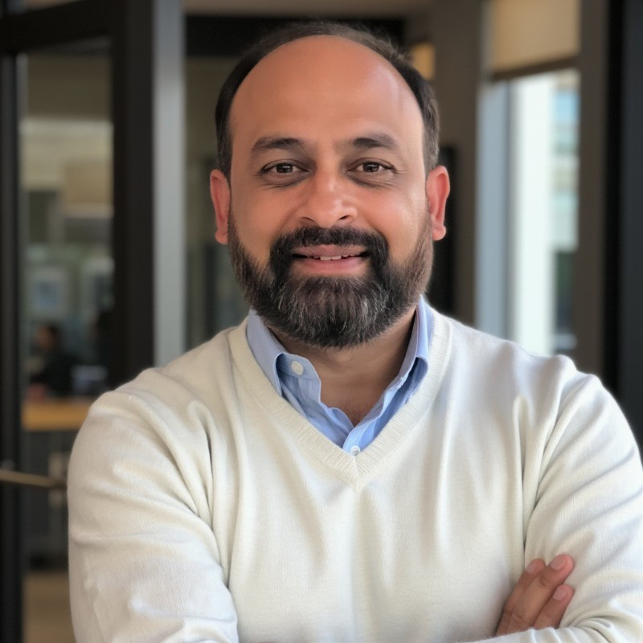

---

candidate: true
title: Chirag Shah
layout: col-generic

---

#### About Me

 
I am Chirag Shah I specialize in strengthening cybersecurity frameworks, reducing corporate liability, improving customer trust, and enabling strategic decision-making for business resilience and growth. My leadership style focuses on developing and retaining top talent while fostering collaboration between security, technology, and business operations.
 
 
Key Expertise
✔ Executive Business Coaching
✔ Leadership Development
✔ Strategic Planning
✔ Sales & Business Development
✔ Performance Management
✔ Team Building
✔ Global Security & Technology Management
✔ Compliance & Privacy Management
✔ Global Threat & Risk Management
 

#### Link to My Video
[Creating a Security-Minded Culture](https://youtu.be/6QiPYstyNwM)
 

#### What open source contributions, research or visible leadership work have you done? If few, what 3 specific outcomes will you deliver in your first 90 days on the board in OWASP and how will members verify the progress?

My contributions and leadership include:  
- Published insights on AI in cybersecurity, insider threats, and risk management as business enablers.  
- Advocated for building security culture across organizations, emphasizing that security is everyone’s responsibility.  
- Spoken on podcasts and in industry forums to highlight governance, compliance, and leadership’s role in security transformation.
If elected, in my first 90 days I will deliver:  

1. **Community Engagement Roundtables**  Host regional listening sessions (Americas, EMEA, APAC, MENA) to capture local priorities.  
   - *Verification:* Published notes, recordings, and a consolidated action plan.  

2. **Project Accountability Framework** — Define measurable health criteria (lead engagement, adoption, update frequency) and apply them to OWASP projects.  
   - *Verification:* Framework published and results visible on the dashboard.  

#### What do you see as the top three challenges for OWASP to increase impact and visibility worldwide? Please provide actionable plan which you can spearhead and lead if need be for the goals you plan to achieve

1. **Limited visibility outside the security community**  
   - *Plan:* Reframe OWASP content into business outcomes (customer trust, compliance, resilience). Publish quarterly “Security as a Business Enabler” reports and toolkits.  

2. **Project sustainability and leadership gaps**  
   - *Plan:* Launch a mentorship pipeline where senior leaders coach new contributors, ensuring continuity and reducing dependency on single maintainers.  

3. **Regional imbalance in adoption**  
   - *Plan:* Provide starter kits, funding, and mentorship for underrepresented regions to launch or revive OWASP chapters. Track and report growth quarterly.
  
#### Several OWASP projects are stale and leads are unresponsive. If elected, what is your concrete, time bound plan to triage these projects, re-engage with inactive leads or relaunch based on clear criteria and timelines?

One of the strengths of OWASP is its open, community-driven project ecosystem. But inactive or stale projects dilute value for our members and external stakeholders. 
If elected, I will prioritize a structured, time-bound approach:

- **First 30 days:** Publish a complete inventory of OWASP projects with a simple health scorecard.  
- **By 60 days:** Reach out to inactive leads, invite co-leads or volunteers, and open a public call for maintainers.  
- **By 90 days:** Relaunch viable projects with new leadership or archive projects transparently with rationale and archived resources.  
Verification: The scorecards, outreach logs, and project decisions will be published for members to verify.  

#### What kind of support will you provide for Arab countries in regard to trending legislation in security, privacy and data protection, for software, OT, and cloud? Will you plan for specific events to cover the growth of talents and skills in secure coding in this particular region?

As part of OWASP’s global mission, I see a strong opportunity to support Arab countries as they implement and mature legislation around security, privacy, and data protection in software, OT, and cloud environments.  My vision is that OWASP can be a bridge helping Arab countries meet legislative requirements while at the same time creating an ecosystem where secure coding is not an afterthought, but a foundational skill.
My focus will include:

- **Regulatory Awareness and Practical Guidance** 
Helping organizations understand and apply new data protection and security laws (e.g., Saudi Arabia’s PDPL, UAE’s Data Law, sector-specific OT directives) with OWASP frameworks and open standards. 
- **•	Localized Outreach** — Creating resources and events in both Arabic and English, making OWASP guidance more accessible to practitioners and organizations across the region.  
- **•	Technology and Compliance Alignment** — Promoting secure coding, secure design, and data protection best practices in line with global OWASP projects, while tailoring recommendations to regional industries such as energy, finance, and telecom.
- **Growing Skills and Secure Coding Talent** — To support long-term resilience, OWASP should also invest in talent and skill development in the Arab region

- **•	Regional Events and Chapters**
Expanding OWASP chapters and supporting local conferences, meetups, and hackathons to raise awareness and strengthen the security community.
- **•	Secure Coding Programs**
Running training, workshops, and competitions that teach OWASP Top Ten, DevSecOps practices, and secure software supply chain management.
- **•	Mentorship and Academic Partnerships**
Building partnerships with universities, coding academies, and professional associations to mentor and inspire the next generation of developers and security leaders.
*Verification:* Publish participation metrics, translated resources, and event outcomes for accountability. 

