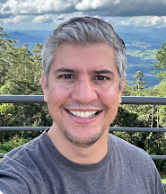

---

candidate: true
title: Diego Silva Martins
layout: col-generic

---

#### About Me

I am a seasoned security professional with extensive experience in handling complex projects. My expertise lies in API Management, SIEM, Single-Sign-On, Identity & Access Management, and Privileged Access Management. Currently, I hold the position of Security Technical Specialist at IBM, where I am dedicated to implementing security solutions and integrations to modernize legacy applications with enhanced security and reliability. With over 20 years in the information technology industry, I began my career as a developer and evolved into a full-stack developer before transitioning into the security domain. In this role, I developed a multitude of connectors for SIEM and continually strive to enhance cybersecurity by creating solutions that eliminate process gaps and fortify the confidentiality, integrity, and availability of systems. Also, I started to learn more about API Security and Management during my time with CA Technologies, where I learned deeply about the potential flaws in the API lifecycle.

I'm counting on your support this October. When you're faced with a choice among outstanding candidates, I urge you to cast your vote for Diego Silva Martins for the Board of Directors. Together, let's embark on a journey to bring about positive changes and take the OWASP community to greater heights!

I am committed to spearheading initiatives that will expand and enrich our community, bolster our projects, secure the necessary resources for their success, and elevate our fundraising endeavors to further our mission. Your vote for me is an investment in a better and stronger OWASP community.

My LinkedIn is https://www.linkedin.com/in/dsmartins/, let's connect!! 
 

#### Link to My Video
https://youtu.be/BwwV5YEvKms
 
 

#### What open source contributions, research or visible leadership work have you done? If few, what 3 specific outcomes will you deliver in your first 90 days on the board in OWASP and how will members verify the progress?
While my direct open-source code contributions are limited, my leadership and community impact are well established:
* Chapter Leadership: As OWASP São Paulo Chapter Leader, I’ve organized technical meetups, mentorship sessions, and outreach initiatives to grow regional engagement.
* Global Governance: Since January 2025, I have served on the OWASP Global Board, where I help shape strategic policies and advocate for transparency, inclusion, and revitalization of OWASP projects.
* Community Advocacy: I’ve supported translation efforts of OWASP materials and promoted onboarding for contributors from underrepresented regions.

First 90 Days on the Board – Deliverables & Verification
To ensure immediate and measurable impact, I committed to three strategic outcomes:

1. OWASP Project Transparency Dashboard
Goal: Launch a public dashboard showing the health status of OWASP projects — active, stale, archived — with leadership and contribution metrics.
Verification:
* Dashboard published on OWASP.org or GitHub
* Monthly updates with project activity indicators
* Open community feedback channel

2. Mentorship & Localization Program
Goal: Create a structured mentorship initiative focused on onboarding contributors from Latin America, Africa, and Arab-speaking regions. Include translation of key OWASP materials.
Verification:
* Public list of mentors and mentees
* Monthly onboarding sessions tracked
* Translated documents (e.g., OWASP Top Ten, ASVS) published

3. Project Evaluation Policy Proposal
Goal: Draft and present to the Board a formal policy defining criteria for evaluating OWASP projects based on activity level, leadership responsiveness, and technical relevance.
Verification:
* Policy document published on OWASP GitHub
* Board meeting minutes confirming review and approval
* Implementation timeline shared with the community
 
 

#### What do you see as the top three challenges for OWASP to increase impact and visibility worldwide? Please provide actionable plan which you can spearhead and lead if need be for the goals you plan to achieve

1. Limited Member Engagement and Perceived Value
Many OWASP contributors and chapter leaders feel disconnected from the broader mission or unclear about the benefits of their involvement.
Actionable Plan:
* Launch a Member Value Framework that includes:
    * Recognition programs (certificates, badges, spotlight features)
    * Priority access to training, mentorship, and speaking opportunities
    * Feedback channels for continuous improvement
Leadership Role: I will lead the design and pilot rollout of this framework with chapters in Latin America and Europe.
Verification:
* Public dashboard tracking member engagement metrics
* Quarterly satisfaction surveys with published results

2. Lack of Structured Mentorship and Knowledge Transfer
OWASP’s vast expertise is often siloed, and new contributors struggle to find guidance or pathways to contribute meaningfully.
Actionable Plan:
* Create the OWASP Mentorship & Knowledge Transfer Program, focused on:
    * Pairing experienced professionals with newcomers
    * Hosting monthly onboarding sessions
    * Building a repository of mentorship resources
Leadership Role: I will recruit mentors, coordinate onboarding events, and oversee content creation.
Verification:
* List of active mentors and mentees published
* Monthly mentorship reports shared with the community

3. Insufficient Localization and Regional Inclusion
OWASP’s global mission is hindered by language barriers and uneven regional representation, especially in Latin America, Africa, and the Middle East.
Actionable Plan:
* Spearhead the Localization & Inclusion Initiative:
    * Translate core OWASP materials (Top Ten, ASVS, Cheat Sheets) into Portuguese, Spanish, and Arabic
    * Activate dormant chapters through regional workshops
    * Promote leadership opportunities for underrepresented regions
Leadership Role: I will coordinate translation efforts, partner with local leaders, and host regional onboarding events.
Verification:
* Translated documents published on OWASP.org
* Chapter activation metrics tracked quarterly
* Regional participation in global events reported

These initiatives reflect my commitment to building a more inclusive, connected, and impactful OWASP community. I’m ready to lead with transparency, accountability, and measurable results.
 
 

#### Several OWASP projects are stale and leads are unresponsive. If elected, what is your concrete, time bound plan to triage these projects, re-engage with inactive leads or relaunch based on clear criteria and timelines?
The Board's responsibility is to propose clear policies, oversee their implementation, and ensure transparency to the community. Operational implementation is the responsibility of the foundation staff.

In this sense, what can be done strategically and discussed jointly with the staff and community is the feasibility of certain guidelines and actions to revitalize stagnant projects.

1. OWASP Project Evaluation Policy
To establish more objective criteria for periodic project evaluation, including:
* Frequency of technical updates
* Leadership engagement
* Community adoption
* Relevance to security trends
2. Public Transparency Dashboard: Request staff to create a public dashboard (e.g., GitHub or Wiki) with:
* Updated project status (active, under review, archived)
* Names of leaders and contact channels
* Open opportunities for new maintainers
3. Community Re-Engagement Program: Mobilize regional chapters and volunteers to:
* Take on projects with technical potential
* Receive mentoring and institutional support
* Relaunch initiatives with an action plan and clear goals
 
 

#### What kind of support will you provide for Arab countries in regard to trending legislation in security, privacy and data protection, for software, OT, and cloud? Will you plan for specific events to cover the growth of talents and skills in secure coding in this particular region?
The OWASP Foundation's mission is to promote open, accessible, and collaborative software security on a global scale. For this mission to be realized in Arab countries, it is essential to invest in structured actions that respect local realities and foster technical and community growth.

1. Strengthening Regional Chapters
Supporting the creation and revitalization of OWASP chapters in Arab countries is a priority, offering:
* Institutional support for chapter registration, promotion, and operation.
* Materials translated into Arabic, focusing on key documents such as the OWASP Top Ten, ASVS, and Cheat Sheets.
* Encouraging the development of local leaders, with mentoring and recognition programs.
This action aligns with the OWASP principles of inclusion, collaboration, and regional empowerment.

2. Regional Coordination Working Group
I propose the creation of a regional working group, comprised of local leaders and global OWASP members, with the following objectives:
* Share best practices among chapters and technical communities.
* Promote joint events, such as webinars, workshops, and hackathons.
* Facilitate understanding of local realities, including legal, cultural, and technical challenges.
* Stimulate sustainable growth in software security, based on OWASP standards and regional needs.

Invitation to the Arab Community
I invite local leaders, security professionals, educators, and volunteers from the Arab region to join this initiative. Let us work together to:
* Discuss plans and practical actions.
* Identify opportunities for collaboration.
* Build a strong regional network aligned with OWASP values.
I am available to support, listen, and collaborate with anyone who wants to strengthen software security in their countries and communities. 
 

#### Why me

OWASP is a global movement — but for too long, parts of the world have remained on the sidelines. I believe it’s time to change that.

As a cybersecurity professional with over two decades of experience, a chapter leader in São Paulo, and now a Global Board Member, I’ve seen firsthand the power of inclusion, mentorship, and transparency. I may not have a long list of open-source commits, but I bring something just as vital: the ability to connect people, build bridges, and deliver results.

In my first 90 days, I’ve committed to real, measurable outcomes — a project transparency dashboard, a mentorship and localization program, and a policy to evaluate and support OWASP projects. These aren’t promises. They’re deliverables.

I’m not here to represent just one region. I’m here to represent every contributor who’s ever felt unheard, every chapter that’s struggled to grow, and every project that deserves a second chance.

Electing me means electing action, accountability, and a voice that reflects OWASP’s true global mission.

Let’s build that future together.

Obrigado. Thank you. Let’s make it happen.

