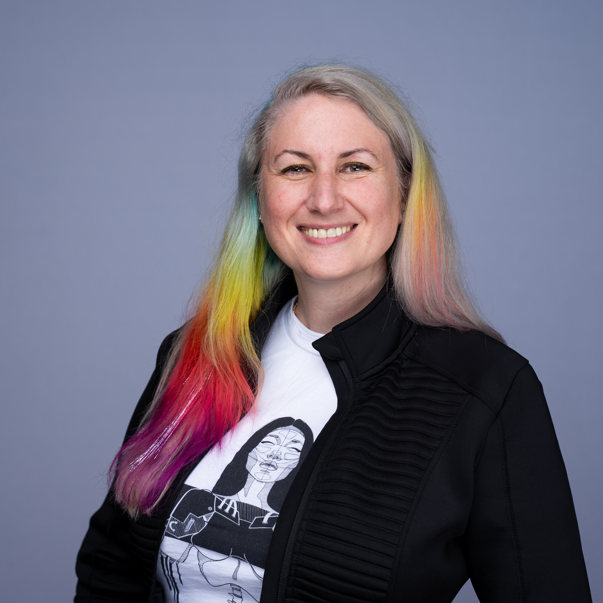

---

candidate: true
title: Marisa Fagan 
layout: col-generic

---

#### About Me

 
 
I’m Marisa Fagan, and I’m currently Head of Product at Katilyst. I’ve worked in AppSec for 16 years as an SDL security culture expert at companies like Atlassian, Synopsys, Bugcrowd, Salesforce, and Facebook. I live in San Francisco, CA, USA.
 
 
OWASP has been with me every step of the way in my career. In 2009, I learned how to incorporate security practices into the SLDC and it turned my career toward security program management. In 2015, I used the OWASP Top 10 training to provide guidance to my security champions. In 2019, I used the OWASP SAMM model to benchmark our program before we did the big scary BSIMM audit so we could walk in with our best foot forward. (We saved hours in the hot seat and thousands on the remediation…)
 
 
In 2017, OWASP helped me get a job after months of searching. I attended the AppSecEU conference, and met lifelong friends there. And then again after the 2023 layoffs, the OWASP community was there for me with tangible help that made a huge difference. I cannot share deeply enough what OWASP has meant to me over the years, and I feel grateful to finally be in a good position to be of service and give back to the organization.
 
 

#### Link to My Video
Marisa Fagan - (<a href="https://youtu.be/CqxiJ4MYYQg">YouTube video</a>)
 
 

#### What open source contributions, research or visible leadership work have you done? If few, what 3 specific outcomes will you deliver in your first 90 days on the board in OWASP and how will members verify the progress?
 
I’ve spent the past 14 months as a contributor to the OWASP project called Security Champions Guide. I’ve also been a Track Lead for the Culture/Management Track of the OWASP AppSec conferences. I’ve spoken at several OWASP events including SAMM User Day and the newly formed OWASP Virtual Chapter meeting. 
 
 
In all of these various volunteering capacities, I’ve learned that a few things need to be urgently dealt with in order to continue the success of the organization. In the first 90 days, I would immediately see to:
<ul>
<li>Reviewing existing efforts to participate in developer conferences and creating a unified schedule of outreach events.</li>
<li>Reviewing and organizing all “AI” related projects under one umbrella landing page on the site</li>
<li>Advocating for a Director of Marketing position or contract created</li>
</ul> 
My progress on all of these initiatives would be visible in the Board Meeting minutes which are made publicly available. 
 
 

#### What do you see as the top three challenges for OWASP to increase impact and visibility worldwide? Please provide actionable plan which you can spearhead and lead if need be for the goals you plan to achieve
 
Let’s face it, OWASP is big enough now to need professional help. We must break out of the AppSec echo chamber and it won’t be easy. This is where my background in behavioral science will shine.  I would advocate for a strategy that addressed at least these three challenges:
 
<ul>
<li>OWASP needs to have a bigger impact on the Developer community. The 2025 AppSecUSA conference saw the lack of interest from developers in attending. After a concerted effort by many volunteers to advertise, the numbers forced a cancellation of the track at the event. A professional plan and calendar of developer-centric outreach events is needed. The effort by Starr to bring OWASP to the 2025 Developer Week conference is a step in the exact right direction, and I will support her and Lauren more in doing more things like this by creating a global plan of events for 2026. </li>
<li>Sponsors could be doing more. At a previous company, we felt like proud OWASP sponsors once in a while, but it was mostly “set it and forget it”. There should be more options for participation. Companies could adopt specific projects more formally.  In our Security Champion Guide project, we created a “Hall of Fame” to acknowledge people and companies’ specific contributions to our project. As a board member, I will share this experience with all project leads. If sponsors enjoy the process and think it is a good value, then the word will spread and there will be more sponsors.</li>
<li>Internationalization is the key to more new members. Advertising in more regions will require region specific language to be most effective.  In my experience, there are many people who want to volunteer for a project but lack the technical knowledge to contribute to the execution. In several cases, there was a language barrier that prevented the person from being comfortable with taking documentation projects. This made me realize that while OWASP projects usually have a regular documentation problem, they also very commonly have an internationalization problem. These language translation projects could make the perfect contribution for a non-native English speaker and would add to the richness of our global community. I would spearhead an initiative to identify people interested in a translation project and pair them with high priority projects. </li>
</ul>
 
 

#### Several OWASP projects are stale and leads are unresponsive. If elected, what is your concrete, time bound plan to triage these projects, re-engage with inactive leads or relaunch based on clear criteria and timelines?
 
Unfortunately stale projects are an unavoidable artifact of being in a volunteer-driven community of this size. This is where as board member I would advocate for “tough love” and close the books on long-since idle projects. Leaving them as-is has caused too much confusion. There cannot be any resources spent on a rallying tour either. Such exercises in futility have been tried before. 
 
 
Here is my plan to triage and bring idle projects to a resolution:  
Step 1: Review the current report (Month 1-2)
<ul><li>Consult previous staff and site administrators on their observations</li>
<li>Review the report recently completed with stats on the problem</li>
<li>Post a notification in owasp.org, Slack and Linkedin</li> </ul>
Step 2: Classify & Decision (Month 3-4)
<ul><li>Criteria for action: No activity on official website for >12 months</li>
<li>Using site administrator support, create automation to place a banner on each idle page explaining it has been moved to Legacy status</li>
<li>Publish the resolution statistics on a centralized page</li>
<li>Provide contact information for leaders to appeal the decision</li> </ul>
Step 3: Appeals (Month 4-6)  
<ul><li>Respond to any appeal requests to not transition the project</li>
<li>Support leaders creating a plan and new charter for the next full year+ </li></ul>
 
 

#### What kind of support will you provide for Arab countries in regard to trending legislation in security, privacy and data protection, for software, OT, and cloud? Will you plan for specific events to cover the growth of talents and skills in secure coding in this particular region?
 
In terms of supporting a region with a new wave of security, privacy and data protection laws, we should lean on our members in the EU region who have blazed the trail with the GDPR laws and bolstered them further with DORA, C5, and the new CRA (Cyber Resilience Act). We have OWASP members that are working as we speak to provide a mapping between the OWASP SAMM model and the controls required in this legislation. 
 
 
As a board member, I will support the global community and this includes Arab countries like Saudi Arabia who are reacting to the new PDPL (Personal Data Protection Law).  
<ul><li>I will reach out to Seba and the SAMM project team to make a plan to do this maturity model mapping for PDPL. </li>
<li>As part of a larger AppSec event, I’d like to see a SAMM User Day in Saudi Arabia within two years to bring training and practice to the region. </li> 
<li>I would reach out to the chapter leaders in Tabuk to learn what support that they can use to see this happen.</li> </ul>
 
 
Reacting is not enough, however. The future changes will come from engineers who are currently students. The latest studies are showing that students are more likely to be reached at events that have gaming themes. 
 
 
As a board member, I will push for our learning & development outreach initiatives to include: 
<ul><li>Reaching out to key universities such as KFUPM (Saudi Arabia) and AUC (Egypt), and bolstering our current connection to FBSU, to recruit for our mentorship and sponsorship programs. </li>
<li>I would like to see OWASP content translated into Arabic and I think this would make a good mentorship project. </li>
<li>I would connect OWASP with universities through games like CTF. (There was a virtual CTF sponsored by OWASP last week that I would advocate for bringing to a broader audience for next year.) </li> </ul>

 
 

