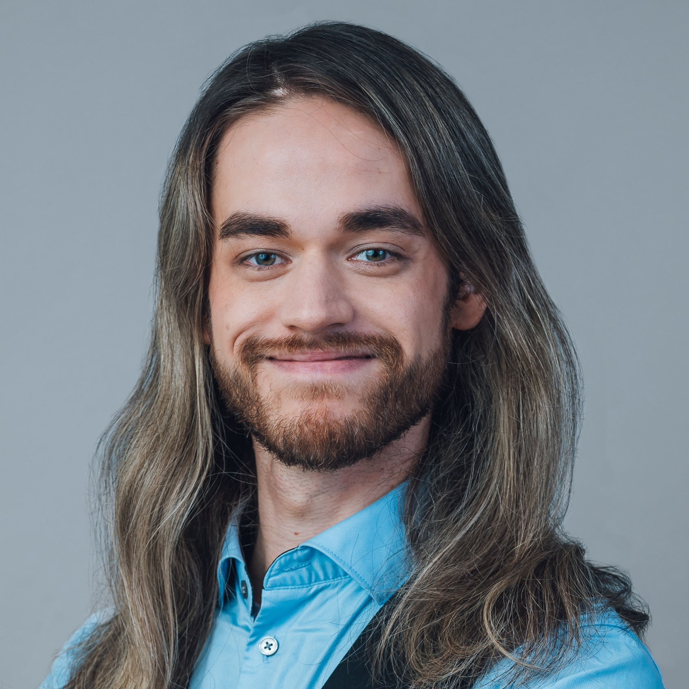

---

candidate: true
title: Michael Koppmann
layout: col-generic

---

#### About Me

Hi OWASP Community, I’m Michael Koppmann.

OWASP has been part of my life in Application Security for over a decade. It began when I was still a young student preparing for my first job interview. Someone gave me one piece of advice: “You should know about the OWASP Top 10.” So I studied it. During the interview, the recruiter actually asked me about several of the risks covered by the Top 10. I could answer the questions, and that was how I started my career as a penetration tester.

Looking back, OWASP did much more than help me through that first interview. Its projects and eventually its community have shaped much of the career that followed. Today, I work as a Senior Information Security Consultant at SBA Research in Austria. Throughout this career, I have worked as a penetration tester, auditor, trainer, speaker, and developer.

For years, OWASP was simply there whenever I needed it. The Top 10 helped me understand common problems, ASVS helped me think about requirements, and Juice Shop supported my training sessions. Projects like SAMM and CycloneDX became valuable parts of my work. At Global AppSec EU in Barcelona in 2025, I met the community behind these projects. People eagerly shared their knowledge, and our conversations led to new ideas and opportunities. The conference had an energy that is hard to describe unless you have experienced it.

It was time to give something back. Together with four other community members, I helped establish the OWASP Vienna Chapter in its current form, and it is becoming an important meeting place for the local security community. I also joined the team developing the OWASP Certified Secure Developer curriculum. Developer education matters deeply to me. I have spent much of my career working with developers, and I want them to understand real security, not compliance theater.

In 2026, I became the lead volunteer at Global AppSec EU Vienna, working alongside more than 30 volunteers. We did whatever it took to keep the event running. It was hard work, but it showed me why I care so much about this community. People from different backgrounds and with different levels of experience came together to make it one of the most successful OWASP events yet.

That is the OWASP I want to support.

#### Why do you want to be on the Board of Directors?

My active involvement in OWASP as an organization is still new, and I think this perspective can be useful. I remember what OWASP looks like from the outside, and notice when it is difficult to understand how something works, who is responsible, where to find information, or how to start contributing. I recently went through the process of starting a chapter, joining a project, working with Foundation staff, and organizing a large event. When something is unnecessarily difficult, I still feel that friction.

I want to reduce the friction people feel when trying to contribute to OWASP. Anyone using an OWASP project should understand how to contribute to it, and anyone with a good idea should be able to find the right people.

I also want us to communicate better when decisions affect volunteers. Volunteers give OWASP something very valuable: their time. We should respect that commitment through clear processes, realistic plans, and open communication. The Board should create an environment in which those doing the work can succeed.

Sometimes I think of OWASP as a kind of guild. People come to learn their craft, ask for help, share what they know, and create tools and knowledge together. Eventually, some of the people who once came looking for help become the ones helping the next person.

Over ten years ago, I came to OWASP as a student looking for knowledge. That knowledge helped me start a career I could hardly have imagined at the time. Today, I want to help ensure that the next student, developer, or security professional can find that same knowledge, meet the same kind of people, and discover that they, too, can become part of the community.

That is why I want to serve on the OWASP Board of Directors.

#### Link to My Video

[OWASP Board Candidate Video 2026: Michael Koppmann](#)
