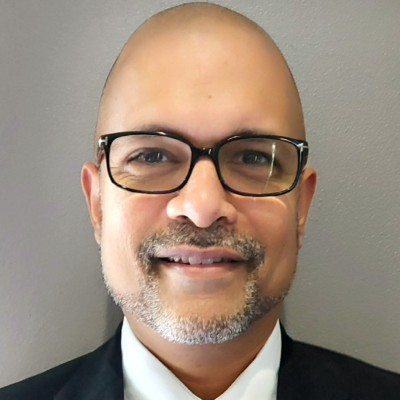

---

candidate: true
title: Louis Griffith
layout: col-sidebar

---

#### About Me


Technology reinvents how we live and work at an enormously fast pace. I’ve spent my career cultivating my passion for programming through continual learning, demanding the best from both myself and my teams to bring about enormous success. My analytical skills and critical thinking have afforded me the ability to streamline operations, putting in place best practices and developing state-of-the-art solutions.

What I bring to the OWASP board is over two decades of cultivated knowledge and experience, which has granted me continued success in this industry. I am employed full-time as a Senior IT Architect role with a local insurance provider. I am also a co-founder of a software start-up developing applications and online services for consumers.  Hopefully, one day, our products and services will be available around the world!

My workflows and processes ensure that technology operates at its greatest potential. My innovative thought processes create a clear path forward, bypassing complexity and adversity, to both meet and exceed goals.

As a leader, I rely on a proactive approach to resolve complex technology problems, working collaboratively to improve user experiences, capability, and productivity. Through my mentorship, countless team members have produced exceptional work and advanced their careers.

My track record of leading by example and integrity while injecting efficiency and innovation at every step in my career makes me uniquely suited to make further change in the technology industry and I expect to carry this same passion as a future board member of OWASP. 
I’m eager to roll up my sleeves and get to work as your next Global Board Member!


#### Link to My Video
[Louis Griffith](#)

#### OWASP has great resources for different people and different roles: CISOs, AppSec Managers, Pentesters, Analysts, Developers, DevOps, QA, and even users. Currently, most of them are either not aware of OWASP, or consider OWASP as a short for the "OWASP Top 10". What practical steps should OWASP take to change that?
```
Answer
```

#### Sometimes local chapters disband before anyone knows they exist and there does not seem to be a strong mechanism to regrow them. How will you enable members to grow OWASP in their localities?
```
Answer
```

#### What experience do you bring serving in a board or executive committee of a large international organization or project?
```
Answer
```

#### COVID-19 has had a major impact on OWASP's major earning sources which were conference tickets / training tickets. What will you do to ensure more balanced funding sources in the future?
```
Answer
```

#### What are the three main things you'd focus on changing/improving for OWASP as an organization, and why?
```
Answer
```

#### Automation and now AI have been good for AppSec in that it has increased the speed of releases, improved detection of coding flaws and reduced overall operating costs. At the same time, jobs in AppSec are moving from analyst positions to lower paid engineering positions. What do you see as being OWASP's role in the industry in ten years and how would you begin to position OWASP to get there?
```
Answer
```
